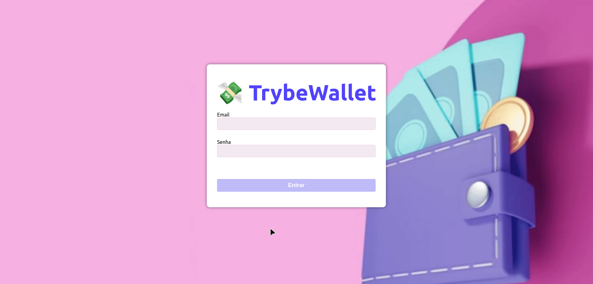

# 💸 Trybe Wallet



### 💻 Sobre o projeto
Neste projeto, desenvolvi uma carteira de controle de gastos com um conversor de moedas, e durante o desenvolvimento, fui capaz de adicionar várias funcionalidades para atender às necessidades dos usuários. Com esta aplicação, sou capaz de realizar as seguintes ações:

- Adicionar e remover gastos facilmente, mantendo o controle das finanças de forma prática.
- Visualizar uma tabela detalhada com todos os meus gastos, facilitando o acompanhamento e a análise.
- Calcular o total de gastos em uma moeda de minha escolha, tornando a gestão financeira ainda mais conveniente.
- Implementar um _store_ Redux em aplicações React para gerenciar o estado da aplicação de forma eficiente.
- Criar _reducers_ no Redux para manipular as alterações no estado da aplicação.
- Definir _actions_ no Redux para despachar eventos que desencadeiam as mudanças de estado necessárias.
- Utilizar _dispatchers_ no Redux para enviar ações aos _reducers_ e atualizar o estado da aplicação.
- Conectar o Redux aos componentes React para manter uma interface de usuário reativa e atualizada.
- Implementar _actions_ assíncronas em minha aplicação React que faz uso do Redux para aprimorar a experiência do usuário.

### Tecnologias e Ferramentas
<div>
  
   
    
    
  
</div>

### ☕ Usando TrybeWallet

Para usar TrybeWallet, siga estas etapas:

```bash
# clone o repositorio
git clone git@github.com:helmatrindade/Project_Trybewallet.git

# Entre na pasta do repositório que você acabou de clonar

# Instale as dependências
npm install

```

Para vizualizar o projeto na porta localhost:

```bash
# No terminal
npm start
```

### 🤗 Minhas Contribuições

Neste projeto, minhas contribuições incluem:
<details>
<summary>Página de Identificação</summary>

- Criei uma página de identificação na qual a pessoa usuária pode inserir seu e-mail e senha.
- Esta página foi definida como a página inicial do aplicativo.
- Implementei a rota para esta página como `/`.
- Implementei a validação do formato do e-mail, assegurando que ele esteja em um formato válido, como 'alguem@alguem.com'.
- Garanti que a senha tenha 6 ou mais caracteres.
- Adicionei um botão para realizar a autenticação.
- O botão foi projetado para ser **desabilitado** caso o e-mail não esteja em um formato válido ou a senha tenha menos de 6 caracteres.

- Implementei a funcionalidade de salvar o e-mail no estado global da aplicação com a chave "_email_" assim que a pessoa usuária fizer o login com sucesso.

- Após o clique no botão de login, a rota é automaticamente redirecionada para `/carteira`, proporcionando uma transição suave para a próxima etapa da aplicação.
</details>

<details>
<summary>Página de Gerenciamento de Carteira</summary>

- Desenvolvi uma página para gerenciar a carteira de gastos em diversas moedas, que é renderizada por um componente chamado Wallet.

- A rota para esta página foi configurada como /carteira.
</details>

<details>
<summary>Cabeçalho (Header) da Página de Carteira</summary>

- Criei um cabeçalho (Header) para a página de carteira, que incluiu as seguintes características:

- O componente Header foi renderizado dentro do componente Wallet.

- Adicionei um elemento para exibir o e-mail da pessoa usuária que fez login.

- Adicionei um elemento para mostrar qual câmbio está sendo utilizado, que neste caso é 'BRL'.

- Inicialmente, configurei esse elemento para exibir o valor 0.
</details>

<details>
<summary>Formulário para Adicionar Despesas</summary>

- Desenvolvi um formulário para adicionar uma despesa, que incluiu as seguintes características:

- O componente WalletForm foi renderizado dentro do componente Wallet.

- Adicionei um campo para adicionar o valor da despesa.

- Incluí um campo para adicionar a descrição da despesa.

- Implementei um campo para selecionar em qual moeda a despesa será registrada.

- Criei um campo para adicionar o método de pagamento, que é um 'select' e a pessoa usuária pode escolher entre 'Dinheiro', 'Cartão de crédito' e 'Cartão de débito'.

- Adicionei um campo para selecionar uma categoria (tag) para a despesa, que é um dropdown com opções como 'Alimentação', 'Lazer', 'Trabalho', 'Transporte' e 'Saúde'.

- Configurei o formulário para salvar todas as informações no estado global.

- Adicionei um botão com o texto 'Adicionar despesa' para salvar as informações da despesa no estado global e atualizar a soma de despesas no header.

</details>

<details>
<summary>Funcionalidade do Botão "Adicionar Despesa"</summary>

- Desenvolvi a funcionalidade do botão "Adicionar despesa" de modo que, ao clicar no botão, as seguintes ações sejam executadas:

- Os valores dos campos são salvos no estado da aplicação na chave expenses, dentro de um array que contém todas as despesas que foram adicionadas.
- Após adicionar a despesa, a soma total das despesas é atualizada no header.
</details>

<details>
<summary>Tabela de Gastos</summary>

- Criei uma tabela de gastos com as seguintes características:

- O componente Table foi renderizado dentro do componente Wallet.
- A tabela possui um cabeçalho com os seguintes valores: Descrição, Tag, Método de pagamento, Valor, Moeda, Câmbio utilizado, Valor convertido, Moeda de conversão, Editar/Excluir.

- Implementei a lógica para que a tabela seja alimentada pelo estado da aplicação.


- O campo de Moeda contém o nome da moeda, como "Dólar Americano/Real Brasileiro" e "Euro/Real Brasileiro".

- O elemento que exibe a Moeda de conversão é sempre 'Real'.
</details>

<details>
<summary>Botão para Deletar Despesas</summary>

- Criei um botão para deletar uma despesa da tabela com as seguintes características:

- O botão é o último item da linha da tabela.
- Quando o botão é clicado, as seguintes ações ocorrem:
- A despesa é deletada do estado global.
- A despesa deixa de ser exibida na tabela.
- O valor total exibido no header é alterado.
</details>

<details>
<summary>Testes Unitários com React Testing Library</summary>

- Desenvolvi testes unitários utilizando a biblioteca React Testing Library para cobrir a página de login do aplicativo.

- Esses testes foram criados com o objetivo de garantir que a página de login funcione corretamente, renderizando os elementos esperados e permitindo a interação adequada com os campos de e-mail e senha, bem como a validação do redirecionamento para a rota /carteira após o clique no botão "Entrar". Eles são parte fundamental do processo de garantir que a funcionalidade do aplicativo esteja correta e que a página de login esteja de acordo com as expectativas do usuário.
</details>

<br>

### 🙋‍♀️  Autor

- [@helmatrindade](https://github.com/helmatrindade)
